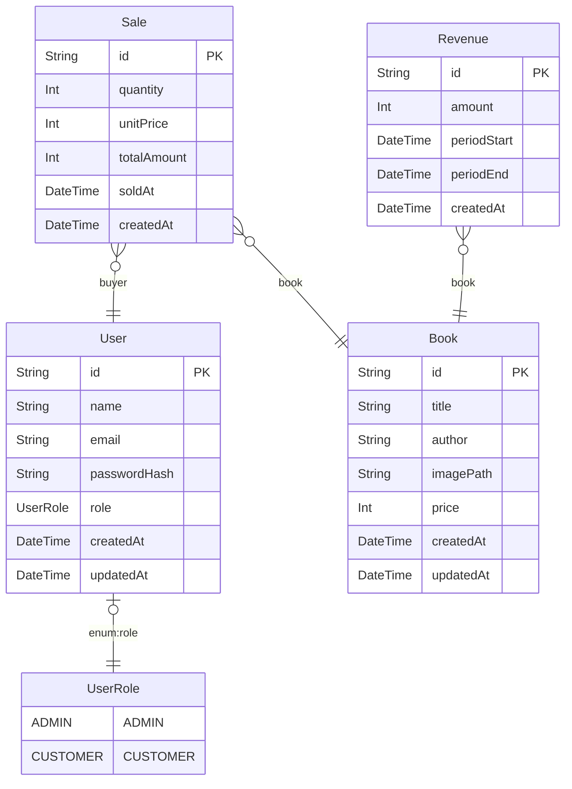

```mermaid
erDiagram

        UserRole {
            ADMIN ADMIN
CUSTOMER CUSTOMER
        }
    
  "User" {
    String id "PK"
    String name 
    String email 
    String passwordHash 
    UserRole role 
    DateTime createdAt 
    DateTime updatedAt 
    }
  

  "Book" {
    String id "PK"
    String title 
    String author 
    String imagePath 
    Int price 
    DateTime createdAt 
    DateTime updatedAt 
    }
  

  "Sale" {
    String id "PK"
    Int quantity 
    Int unitPrice 
    Int totalAmount 
    DateTime soldAt 
    DateTime createdAt 
    }
  

  "Revenue" {
    String id "PK"
    Int amount 
    DateTime periodStart 
    DateTime periodEnd 
    DateTime createdAt 
    }
  
    "User" |o--|| "UserRole" : "enum:role"
    "Sale" }o--|| "Book" : "book"
    "Sale" }o--|| "User" : "buyer"
    "Revenue" }o--|| "Book" : "book"
```
